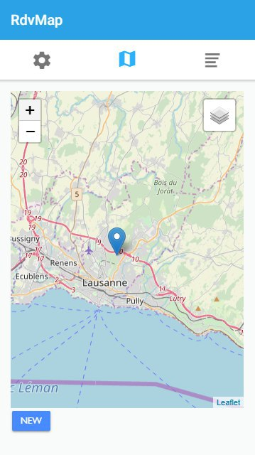

# GeekFeelings
This app is linked to the GeekFeelings API developped during the Webserv course. It's dedicated to the phone. It provide the use of camera and geolocalisation features.
# Description
This application is part of a lesson at the Heig-vd. The objective is to create an application based on an API that we have developped.
The application is developped on Angular with Ionic.
# Deployment
The application has not been published on the Play Store or the Apple Store. It can be deployed to a phone using Ionic built in tools. See Ionic documentation on testing and deploying the app on a phone.
# What do we provide with our application
The application provide :
* Login
* Register
* Edit your profile and add pictures to your profile
* See all rendez-vous on a map
* Add a rendez-vous
* Manage your rendez-vous

## Login
Enter your credentials to login if you have an account or touch register to register.

## Register
Fill the formular to register yourself. Choose a First name, a username, a password, a birthdate, a city and a Gender. Touch register to confirm registration.

## Profile
All the account photos are here. It's possible to add new ones by touching the "plus" button, change the description by touching it. Then you take a photo and validate it if it suits you. To be able to show people your interests, add new one by touching the "enter a new tag" input. Just fill one of your interest and press "enter". Delete it by touching the cross on the tag.
To save everything you can touch the button "Save" and it will be stored in the datebase.

To logout, touch the button logout.

## Map
Show your location on the map.

Show all the near rendez-vous, the rendez-vous you made and let you manage those rendez-vous.

## Rendez-vous
List all rendez-vous and let you manage those. 

Touch the button modify to manage the rendez-vous. Fill the formular to modify the rendez-vous and save it.

Touch the button delete to delete the rendez-vous.

It's also possible to add a rendez-vous by touching the button add on top of the screen.

